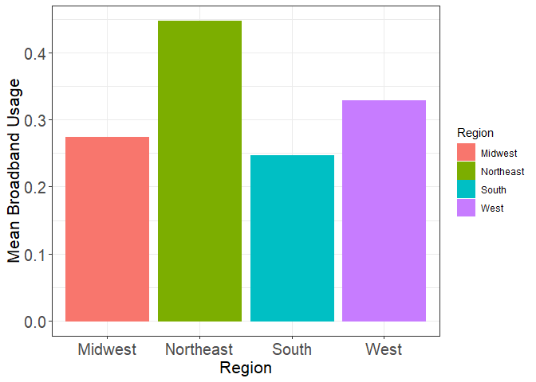

Internet in the U.S.
================
Y. Yu
5/17/2021

``` r
library(tidyverse)
```

    ## -- Attaching packages --------------------------------------- tidyverse 1.3.0 --

    ## v ggplot2 3.3.2     v purrr   0.3.4
    ## v tibble  3.1.0     v dplyr   1.0.2
    ## v tidyr   1.1.2     v stringr 1.4.0
    ## v readr   1.3.1     v forcats 0.5.0

    ## -- Conflicts ------------------------------------------ tidyverse_conflicts() --
    ## x dplyr::filter() masks stats::filter()
    ## x dplyr::lag()    masks stats::lag()

``` r
library(ggplot2)
library(dplyr)
```

``` r
bb <- readr::read_csv('https://raw.githubusercontent.com/rfordatascience/tidytuesday/master/data/2021/2021-05-11/broadband.csv')
```

    ## Parsed with column specification:
    ## cols(
    ##   ST = col_character(),
    ##   `COUNTY ID` = col_double(),
    ##   `COUNTY NAME` = col_character(),
    ##   `BROADBAND AVAILABILITY PER FCC` = col_character(),
    ##   `BROADBAND USAGE` = col_character()
    ## )

``` r
head(bb)
```

    ## # A tibble: 6 x 5
    ##   ST    `COUNTY ID` `COUNTY NAME`  `BROADBAND AVAILABILITY PER~ `BROADBAND USAG~
    ##   <chr>       <dbl> <chr>          <chr>                        <chr>           
    ## 1 AL           1001 Autauga County 0.81                         0.28            
    ## 2 AL           1003 Baldwin County 0.88                         0.30            
    ## 3 AL           1005 Barbour County 0.59                         0.18            
    ## 4 AL           1007 Bibb County    0.29                         0.07            
    ## 5 AL           1009 Blount County  0.69                         0.09            
    ## 6 AL           1011 Bullock County 0.06                         0.05

``` r
bb$`BROADBAND AVAILABILITY PER FCC` <- as.numeric(bb$`BROADBAND AVAILABILITY PER FCC`)
```

    ## Warning: NAs introduced by coercion

``` r
bb$`BROADBAND USAGE` <- as.numeric(bb$`BROADBAND USAGE`)
```

    ## Warning: NAs introduced by coercion

``` r
us <- bb %>% group_by(ST) %>% summarize(mean_availability = mean(`BROADBAND AVAILABILITY PER FCC`), mean_usage = mean(`BROADBAND USAGE`))
```

    ## `summarise()` ungrouping output (override with `.groups` argument)

``` r
ggplot(us, aes(ST, mean_availability, color = ST, fill = mean_availability)) +
  geom_col(width = 0.5) + 
  theme_bw() +
  theme(legend.position = "none",
        axis.text.x = element_text(size = 10,angle = 0),
        axis.text.y = element_text(size = 6, angle = 0)) +
  labs(y = "Mean Broadband Availability", x = "State") + 
  coord_flip() 
```

    ## Warning: Removed 12 rows containing missing values (position_stack).

<!-- -->

``` r
ggplot(us, aes(ST, mean_usage, color = ST, fill = mean_usage)) +
  geom_col(width = 0.5) + 
  theme_bw() +
  theme(legend.position = "none",
        axis.text.x = element_text(size = 10,angle = 0),
        axis.text.y = element_text(size = 6, angle = 0)) +
  labs(y = "Mean Broadband Usage", x = "State") + 
  coord_flip() 
```

    ## Warning: Removed 3 rows containing missing values (position_stack).

<!-- -->

``` r
state_region_crosswalk<- readr::read_csv('https://raw.githubusercontent.com/cphalpert/census-regions/master/us%20census%20bureau%20regions%20and%20divisions.csv')
```

    ## Parsed with column specification:
    ## cols(
    ##   State = col_character(),
    ##   `State Code` = col_character(),
    ##   Region = col_character(),
    ##   Division = col_character()
    ## )

``` r
state_region <- state_region_crosswalk %>% select(`State Code`, `Region`)
# assiging each state with a region 
bb <- bb %>% left_join(state_region, by = c("ST" = "State Code"))
head(bb)
```

    ## # A tibble: 6 x 6
    ##   ST    `COUNTY ID` `COUNTY NAME`  `BROADBAND AVAILABIL~ `BROADBAND USAG~ Region
    ##   <chr>       <dbl> <chr>                          <dbl>            <dbl> <chr> 
    ## 1 AL           1001 Autauga County                 0.81              0.28 South 
    ## 2 AL           1003 Baldwin County                 0.88              0.3  South 
    ## 3 AL           1005 Barbour County                 0.59              0.18 South 
    ## 4 AL           1007 Bibb County                    0.290             0.07 South 
    ## 5 AL           1009 Blount County                  0.69              0.09 South 
    ## 6 AL           1011 Bullock County                 0.06              0.05 South

``` r
bb <- bb %>% drop_na()
bb %>% group_by(Region) %>%
  summarize(mean_availability = mean(`BROADBAND AVAILABILITY PER FCC`), mean_usage = mean(`BROADBAND USAGE`)) %>%
  ggplot(aes(Region, mean_availability, color = Region, fill = Region)) +
  geom_col() + 
  theme_bw() +
  theme(axis.text = element_text(size = 15),
        axis.title = element_text(size = 16)) +
  labs(y = "Mean Broadband Availability Per FCC", x = "Region") 
```

    ## `summarise()` ungrouping output (override with `.groups` argument)

<!-- -->

``` r
bb %>% group_by(Region) %>%
  summarize(mean_usage = mean(`BROADBAND USAGE`)) %>%
  ggplot(aes(Region, mean_usage, color = Region, fill = Region)) +
  geom_col() + 
  theme_bw() +
  theme(axis.text = element_text(size = 15),
        axis.title = element_text(size = 16)) +
  labs(y = "Mean Broadband Usage", x = "Region") 
```

    ## `summarise()` ungrouping output (override with `.groups` argument)

<!-- -->
