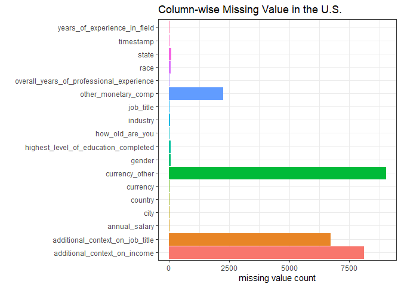
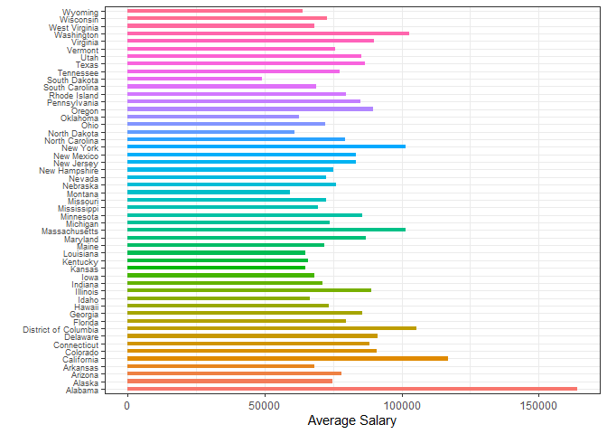
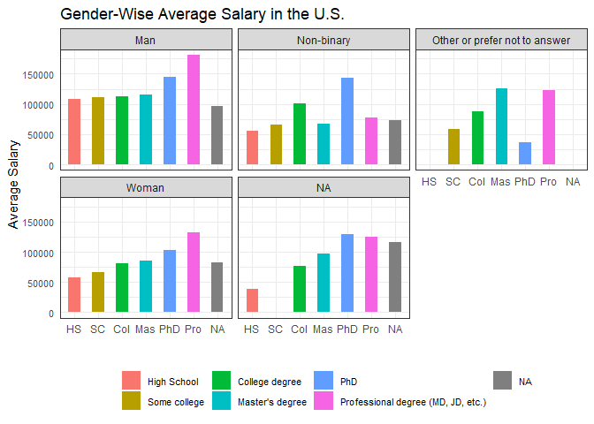
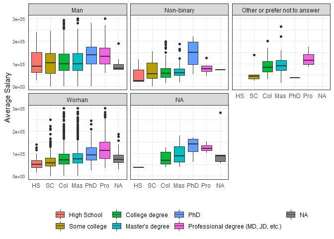
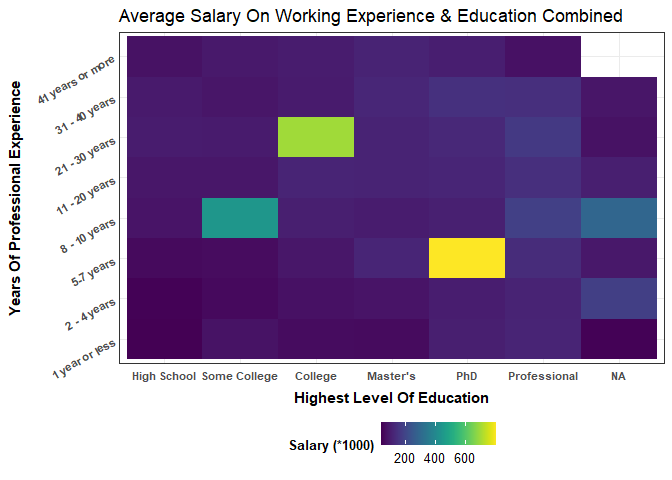
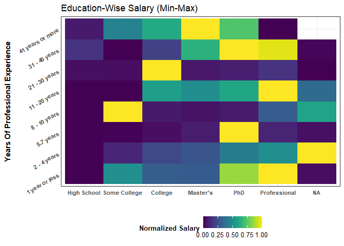
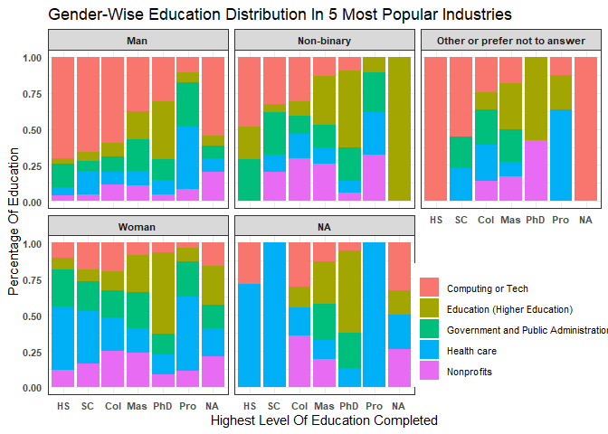
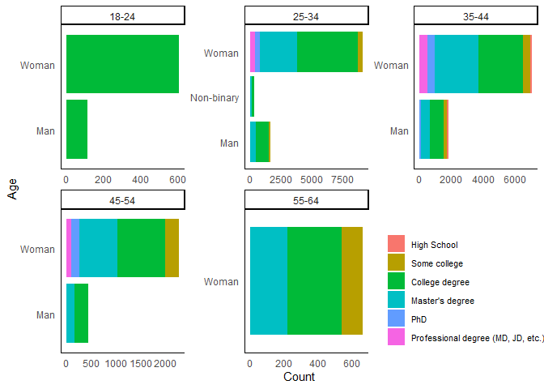

Data Wrangling and Visualization on Manager Survey
================
Y. Yu

``` r
library(tidyverse)
library(ggplot2)
library(dplyr)
library(knitr)
library(viridis)
```

# Data Exploration

``` r
survey <- readr::read_csv('https://raw.githubusercontent.com/rfordatascience/tidytuesday/master/data/2021/2021-05-18/survey.csv')
head(survey)
```

    ## # A tibble: 6 x 18
    ##   timestamp  how_old_are_you industry  job_title  additional_cont~ annual_salary
    ##   <chr>      <chr>           <chr>     <chr>      <chr>                    <dbl>
    ## 1 4/27/2021~ 25-34           Educatio~ Research ~ NA                       55000
    ## 2 4/27/2021~ 25-34           Computin~ Change & ~ NA                       54600
    ## 3 4/27/2021~ 25-34           Accounti~ Marketing~ NA                       34000
    ## 4 4/27/2021~ 25-34           Nonprofi~ Program M~ NA                       62000
    ## 5 4/27/2021~ 25-34           Accounti~ Accountin~ NA                       60000
    ## 6 4/27/2021~ 25-34           Educatio~ Scholarly~ NA                       62000
    ## # ... with 12 more variables: other_monetary_comp <chr>, currency <chr>,
    ## #   currency_other <chr>, additional_context_on_income <chr>, country <chr>,
    ## #   state <chr>, city <chr>, overall_years_of_professional_experience <chr>,
    ## #   years_of_experience_in_field <chr>,
    ## #   highest_level_of_education_completed <chr>, gender <chr>, race <chr>

``` r
dim(survey)
```

    ## [1] 26232    18

``` r
survey$highest_level_of_education_completed <- factor(survey$highest_level_of_education_completed, levels = c(
"High School", "Some college", "College degree", "Master's degree", "PhD", "Professional degree (MD, JD, etc.)", "NA" 
))
```

Let’s focus on the U.S. only for the moment.

``` r
survey_us <- survey %>%
  filter(country == "United States")
```

``` r
missing_values <- data.frame(col = names(survey_us),missing_value=colSums(is.na(survey_us)))
rownames(missing_values) <- 1:nrow(missing_values)
ggplot(missing_values, aes(col, missing_value, color = col, fill = col)) +
  geom_col() +
  theme_bw() +
  theme(legend.position = "none") +
  ggtitle("Column-wise Missing Value in the U.S.") +
  xlab("") + ylab("missing value count") + 
  coord_flip() 
```

<!-- -->

Since we are in the U.S., it would be interesting to see the average
`annual_salary` in each state. As we can see from the following code,
the dataset on the U.S. states is super messy and so many “states” do
not make any sense.

``` r
survey_us %>% filter(str_detect(state, ", ", negate = TRUE)) %>% 
  group_by(state) %>%
  summarize(mean_salary = mean(annual_salary)) %>%
  ggplot(aes(state, mean_salary, fill = state)) +
  geom_col(width = 0.5) +
  theme_bw() +
  theme(legend.position = "none",
        axis.text.y = element_text(size = 7)) +
  xlab("") +
  ylab("Average Salary") +
  coord_flip()
```

    ## `summarise()` ungrouping output (override with `.groups` argument)

<!-- -->

Surprisingly, Alabama has the hightest average salary.

``` r
survey_us$highest_level_of_education_completed <- factor(survey_us$highest_level_of_education_completed, levels = c(
"High School", "Some college", "College degree", "Master's degree", "PhD", "Professional degree (MD, JD, etc.)", "NA" 
))
survey_us %>% group_by(highest_level_of_education_completed, gender) %>%
  summarize(mean_salary = mean(annual_salary)) %>%
  ggplot(aes(highest_level_of_education_completed, mean_salary, fill = highest_level_of_education_completed)) +
  geom_col(width = 0.5) +
  facet_wrap(~gender) +
  theme_bw() +
  theme(legend.position = "bottom",
        axis.text.y = element_text(size = 8),
        legend.title = element_blank(),
        axis.ticks = element_blank(),
        legend.text = element_text(size = 8)) +
  scale_x_discrete(labels = c("HS", "SC", "Col", "Mas", "PhD", "Pro", "NA")) + 
  xlab("") +
  ylab("Average Salary") +
  ggtitle("Gender-Wise Average Salary in the U.S.")
```

<!-- -->

``` r
survey_us %>% group_by(highest_level_of_education_completed, gender) %>%
  summarize(annual_salary) %>% filter(annual_salary <= 300000) %>%
  ggplot(aes(highest_level_of_education_completed, annual_salary, fill = highest_level_of_education_completed)) +
  geom_boxplot() +
  facet_wrap(~gender) +
  theme_bw() +
  theme(legend.position = "bottom",
        axis.text.y = element_text(size = 7),
        legend.title = element_blank(),
        axis.ticks = element_blank()) +
  xlab("") +
  ylab("Average Salary")  +
  scale_x_discrete(labels = c("HS", "SC", "Col", "Mas", "PhD", "Pro", "NA")) 
```

<!-- -->

``` r
unique(survey$overall_years_of_professional_experience)
```

    ## [1] "5-7 years"        "8 - 10 years"     "2 - 4 years"      "21 - 30 years"   
    ## [5] "11 - 20 years"    "1 year or less"   "41 years or more" "31 - 40 years"

``` r
survey$overall_years_of_professional_experience <- factor(survey$overall_years_of_professional_experience, levels = c(
  "1 year or less", "2 - 4 years", "5-7 years", "8 - 10 years", "11 - 20 years", "21 - 30 years", "31 - 40 years", "41 years or more"))
```

``` r
p1 <- survey %>% group_by(overall_years_of_professional_experience, highest_level_of_education_completed) %>%
  summarize(salary = mean(annual_salary)/1000) %>%
  ggplot(aes(highest_level_of_education_completed, overall_years_of_professional_experience, fill = salary)) +
  geom_tile() +
  xlab("Highest Level Of Education") +
  ylab("Years Of Professional Experience")  +
  scale_x_discrete(labels = c("High School", "Some College", "College", "Master's", "PhD", "Professional", "NA"))+
  scale_fill_viridis(name = "Salary (*1000)") +
  theme_bw() +
  theme(legend.position = "bottom",
        axis.text.y = element_text(size = 8,  angle = 30, face = "bold"),
        axis.text.x = element_text(size = 8, face = "bold"),
        axis.title.x = element_text(vjust=-1, face = "bold"),
        axis.title.y = element_text(face = "bold"),
        legend.title = element_text(size = 10, face = "bold"),
        axis.ticks = element_blank(),
        legend.text = element_text(size = 10)) +
  ggtitle("Average Salary On Working Experience & Education Combined")

p1
```

<!-- -->

``` r
p2 <- survey %>% group_by(overall_years_of_professional_experience, highest_level_of_education_completed) %>%
  summarize(salary = mean(annual_salary)) %>%
  group_by(overall_years_of_professional_experience) %>%
  mutate(min_max = (salary - min(salary))/(max(salary)- min(salary))) %>%
  ggplot(aes(highest_level_of_education_completed, overall_years_of_professional_experience, fill = min_max)) +
  geom_tile() +
  xlab("") +
  ylab("Years Of Professional Experience")  +
  scale_x_discrete(labels = c("High School", "Some College", "College", "Master's", "PhD", "Professional", "NA"))+
  scale_fill_viridis(name = "Normalized Salary") +
  theme_bw() +
  theme(legend.position = "bottom",
        axis.text.y = element_text(size = 8,  angle = 30, face = "bold"),
        axis.text.x = element_text(size = 8, face = "bold"),
        axis.title.x = element_text(vjust=-1, face = "bold"),
        axis.title.y = element_text(face = "bold"),
        legend.title = element_text(size = 10, face = "bold"),
        axis.ticks = element_blank(),
        legend.text = element_text(size = 10),
        legend.title.align = 1) +
  ggtitle("Education-Wise Salary (Min-Max)")

p2 
```

<!-- -->

``` r
top_5_industry <- survey %>%
  group_by(industry) %>%
  summarize(total_count=n()) %>%
  arrange(desc(total_count)) %>%
  top_n(5, total_count)

survey %>%
  inner_join(top_5_industry, by = "industry") %>%
  #filter(industry %in% as.vector(top_5_industry)) %>%
  group_by(industry,highest_level_of_education_completed, gender) %>%
  summarize(percentage = 100 * n()/total_count) %>%
  distinct() %>%
  arrange(desc(percentage)) %>%
  ggplot(aes(highest_level_of_education_completed, percentage, fill = industry)) +
  geom_bar(stat = "identity", position = "fill") + 
  facet_wrap(~gender) +
  theme_bw() +
  theme(axis.text = element_text(size = 8, face = "bold"),
        legend.title = element_blank(),
        axis.ticks = element_blank(),
        legend.position = c(0.845, 0.2),
        legend.text = element_text(size = 8),
        strip.text = element_text(size=8, face = "bold")) +
  scale_x_discrete(labels = c("HS", "SC", "Col", "Mas", "PhD", "Pro", "NA")) + 
  xlab("Highest Level Of Education Completed") +
  ylab("Percentage Of Education") +
  ggtitle("Gender-Wise Education Distribution In 5 Most Popular Industries")
```

<!-- -->

``` r
survey %>% group_by(gender, how_old_are_you, highest_level_of_education_completed) %>%
  summarize(count = n()) %>%
  arrange(desc(count)) %>%
  filter(count > 100) %>%
  ungroup() %>%
  ggplot(aes(gender, count, fill = highest_level_of_education_completed)) +
  geom_bar(stat = "identity", position = "stack") +
  facet_wrap(~how_old_are_you, scale = "free") + 
  coord_flip() +
  theme_classic() +
  theme(
    legend.position = c(0.85, 0.2),
    legend.title = element_blank(),
    legend.text = element_text(size = 8),
    axis.ticks = element_blank(),
    axis.text = element_text(size = 9),
    axis.title = element_text(size = 11)
  ) +
  labs(x = "Age", y = "Count") 
```

<!-- -->
